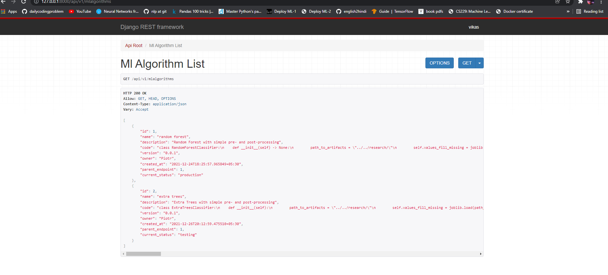
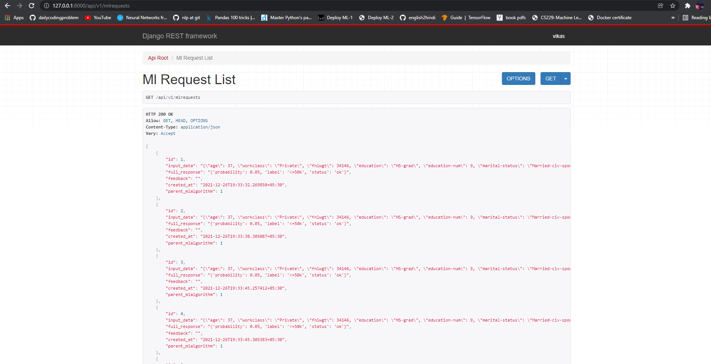
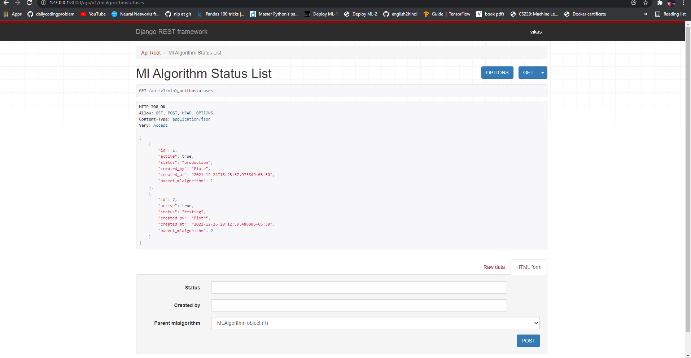
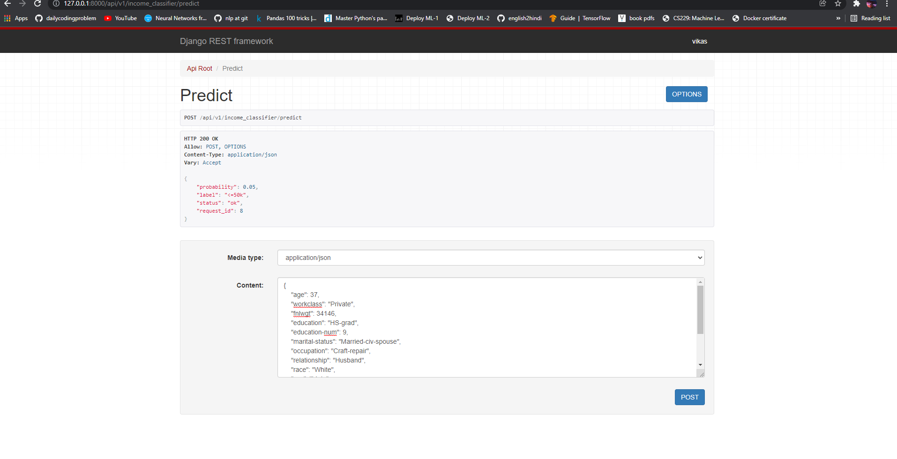

# ML as a service Api
This is ML as a service endpoint where users can upload algorightms/models and also make request for prediction on the algorithm.

### Features:
 - Algorithms
  

 - All the requests on the API

   

 - Status of algorithms

   

 - predictions and values

   

## Installing packages:

###     using Python-Pipenv package

```
$ pipenv install -r requirements.txt
```
Then to activate env 
```
$ pipenv shell
```

### For pip users:

```
$ pip install -r requirements.txt
```

## Running the server:
```
$ python manage.py runserver 
```
Then open url ::    http://127.0.0.1:8000/api/v1 in your browser

### Applying Migrations on the Project 

```
python manage.py makemigrations
python manage.py migrate 
python manage.py runserver
```
You can use *showmigration*  to list projects migration.

### for running test in this
```
python manage.py test
```

# Downloading the dataset:

##  https://archive.ics.uci.edu/ml/datasets/adult

This model predicts whether a particular user will have salary above or beloe 50k.

For more details **_Reaserch_** directory.

## Note: this project is still in development and there are stil more things to add like A/B testing , more algorithms and adding more test cases as well.


